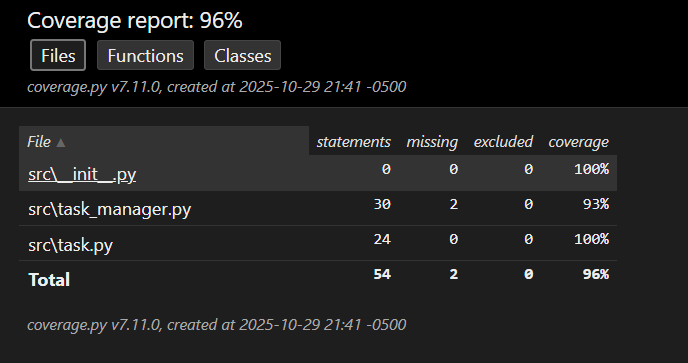
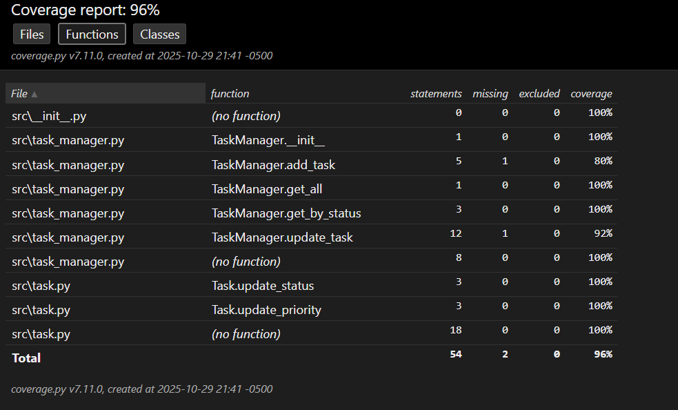
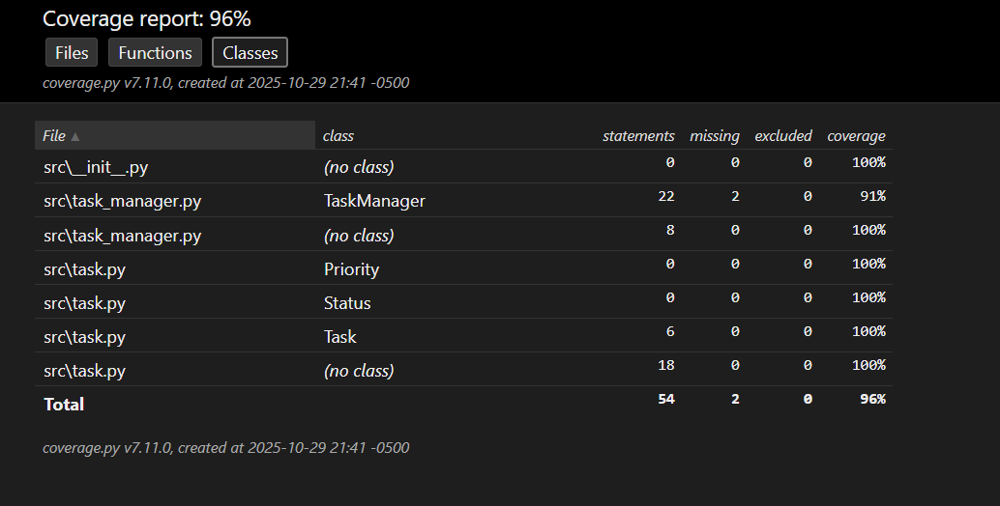

# Todo-list
## Eliecer Guevara Fuentes

## Imagenes de evidencia
- **Files covertura**
  

- **Functions Covertura**
  

- **Classes Covertura**
  


## Entorno recomendado (Windows + Git Bash)
Para evitar problemas con el PATH del ejecutable `pytest`, se recomienda ejecutar **vía módulo** dentro de un **entorno virtual**.

```bash
python -m venv .venv
source .venv/Scripts/activate

python -m pip install --upgrade pip
python -m pip install -r requirements.txt

python -m pytest -v --cov=src --cov-report=term-missing --cov-report=html

start coverage/index.html
```
> Nota: Si usa CMD/PowerShell, active el entorno con `.venv\Scripts\activate`.

## Instalación (alternativa rápida)
```bash
pip install -r requirements.txt
```
> Si `pytest` no se encuentra como comando, utilice `python -m pytest` o active el entorno virtual.

## Ejecutar Tests y Cobertura (forma estándar)
```bash
pytest -v --cov=src --cov-report=term-missing --cov-report=html
```
**Sugerencia:** En Windows + Git Bash, prefiera:
```bash
python -m pytest -v --cov=src --cov-report=term-missing --cov-report=html
```

## Estructura
```
src/
  task.py
  task_manager.py
tests/
  test_task.py
  test_manager.py
docs/
  design.md
```

## Solución de problemas (FAQ)
- **`bash: pytest: command not found`**  
  Use `python -m pytest` y verifique que el entorno virtual esté activo (`source .venv/Scripts/activate`).
- **`ModuleNotFoundError: No module named 'src'`**  
  Ejecute los tests desde la raíz del proyecto (`todo-list-testing/`).

## CI/CD
Incluye workflow de GitHub Actions para ejecutar tests y cobertura en cada push/PR.
